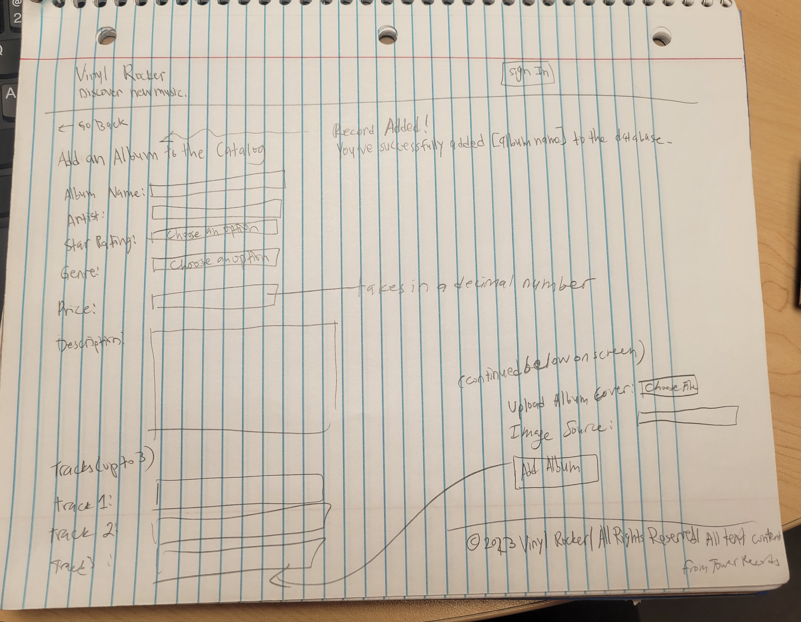

# Project 3: Design Journey

**For each milestone, complete only the sections that are labeled with that milestone.** Refine all sections before the final submission.

You are graded on your design process. If you later need to update your plan, **do not delete the original plan, rather leave it in place and append your new plan _below_ the original.** Then explain why you are changing your plan. Any time you update your plan, you're documenting your design process!

**Replace ALL _TODOs_ with your work.** (There should be no TODOs in the final submission.)

Be clear and concise in your writing. Bullets points are encouraged.

**Everything, including images, must be visible in _Markdown: Open Preview_.** If it's not visible in the Markdown preview, then we can't grade it. We also can't give you partial credit either. **Please make sure your design journey should is easy to read for the grader;** in Markdown preview the question _and_ answer should have a blank line between them.


## Design Plan (Milestone 1)

**Make the case for your decisions using concepts from class, as well as other design principles, theories, examples, and cases from outside of class (includes the design prerequisite for this course).**

You can use bullet points and lists, or full paragraphs, or a combo, whichever is appropriate. The writing should be solid draft quality.


### Catalog (Milestone 1)
> What will your catalog website be about? (1 sentence)

My catalog website will be a place for users to explore music albums by different artists.


### _Consumer_ Audience (Milestone 1)
> Briefly explain your site's _consumer_ audience. Your audience should be specific, but not arbitrarily specific. (1 sentence)
> Justify why this audience is a **cohesive** group. (1-2 sentences)

Young adult music enthusiasts who like to buy physical albums.

This is a cohesive audience because it selects a specific audience, which is music enthusiasts, but is not overly specific because I chose young adults as a whole. The specific hobby is those who prefer to listen on and collect physical albums since music enthusiasts could simply like to listen digitally.


### _Consumer_ Audience Goals (Milestone 1)
> Document your _consumer_ audience's goals for using this catalog website.
> List each goal below. There is no specific number of goals required for this, but you need enough to do the job (Hint: It's more than 1. But probably not more than 3.)
> **Hint:** Users will be able to view all entries in the catalog and insert new entries into the catalog. The audience's goals should probably relate to these activities.

Goal 1: Browse for new albums and artists that they are not familiar with

- **Design Ideas and Choices** _How will you meet those goals in your design?_
  - Filter feature that lets user filter by new artists and genres
- **Rationale & Additional Notes** _Justify your decisions; additional notes._
  - These types of filters will help my audience discover new artists since by filtering by a certain genre or by new artists, the audience will be able to see unfamiliar albums

Goal 2: Learn more about specific albums

- **Design Ideas and Choices** _How will you meet those goals in your design?_
  - Album covers are clickable and send user to a more detailed page about the album.
- **Rationale & Additional Notes** _Justify your decisions; additional notes._
  - Since we have a gallery view of album covers, not much information can be shown without overwhelming the user. This is why I will have a detailed page for each album that has more information like the songs in the album, description of the album, etc. This allows the audience to learn more about the album and decide whether or not they would want to purchase it at a different site.

Goal 3: To learn more about the average prices of the albums

- **Design Ideas and Choices** _How will you meet those goals in your design?_
  - There could also be a place where each album is displayed where a typical price of the album is displayed
  - Display prices very clearly
- **Rationale & Additional Notes** _Justify your decisions; additional notes._
  - Since my audience is music enthusiasts who like to buy physical albums, they would most likely be browsing this type of site to see if they can afford an album, so I think displaying everything about the album, including its average sell price is needed.


### _Consumer_ Audience Device (Milestone 1)
> How will your _consumer_ audience access this website? From a narrow (phone) or wide (laptop) device?
> Justify your decision. (1 sentence)

Laptop

Most people do their online searching on sites like Wikipedia on a laptop and I think my audience would do the same because it is easier to see all of the products on a large screen rather than scroll endlessly on a mobile device.


### _Consumer_ Persona (Milestone 1)
> Use the goals you identified above to develop a persona of your site's _consumer_ audience.
> Your persona must have a name and a face. The face can be a photo of a face or a drawing, etc.


Randy, Painter

**Factors that Influence Behavior:**

- Social media trends (Randy likes to follow the trends so that he purchases hot records)
- Time of year (As an artist, Randy makes money based on commisions and often does not have enough to buy expensive vinyl records, so he looks to buy them during holidays.)
- People's opinions

**Goals:**

- Be an expert about music albums and their respective artists
- To collect as many classic and trendy vinyl records to add to his collection

**Obstacles:**

- Has trouble finding information efficiently about different albums
- Constantly changes his mind about which records to he wants to learn more about because trends change all the time
- Can't afford to always buy albums so would like more information about prices before thinking about purchasing

**Desires:**

- Know everything about artists' records
- Collect all of the classic artists' records
- To buy the newest, most popular records


### _Administrator_ Audience (Milestone 1)
> Briefly explain your site's _administrator_ audience. Your audience should be specific, but not arbitrarily specific. (1 sentence)
> Justify why this audience is a **cohesive** group. (1-2 sentences)

Vinyl music experts who keep up to date about the latest music trends

This is a cohesive audience because music experts would be best to play administrators for this type of website. It is not arbitrarily specific because there are plenty of music experts and their job is to solely research trends, and not overly broad because I am not saying my audience is all experts of music, but rather experts in vinyl music.


### _Administrator_ Audience Goals (Milestone 1)
> Document your _administrator_ audience's goals for using this catalog website.
> List each goal below. There is no specific number of goals required for this, but you need enough to do the job (Hint: It's more than 1. But probably not more than 3.)
> **Hint:** Users will be able to view all entries in the catalog and insert new entries into the catalog. The audience's goals should probably relate to these activities.

Goal 1: To keep the website up to date with the newest albums

- **Design Ideas and Choices** _How will you meet those goals in your design?_
  - Have a feature where administrators can edit what is displayed on the informational music site
- **Rationale & Additional Notes** _Justify your decisions; additional notes._
  - Administrators should be able to delete and add music based on what is trendy and what isn't

Goal 2: Make sure the website has no bugs

- **Design Ideas and Choices** _How will you meet those goals in your design?_
  - Administrators will have privileges that consumers don't have that can be accessed through a login screen
- **Rationale & Additional Notes** _Justify your decisions; additional notes._
  - This ensures that consumers cannot manipulate album data such as prices. In other words we want to prevent records being added or deleted based on consumers' own self interests

Goal 3: Keep the website organized

- **Design Ideas and Choices** _How will you meet those goals in your design?_
  - Create feature to add and delete tags assigned to music albums so that they filter properly
- **Rationale & Additional Notes** _Justify your decisions; additional notes._
  - This makes it easier for administrators to delete and add music records that need updating by simply filtering by tags themselves

### _Administrator_ Persona (Milestone 1)
> Use the goals you identified above to develop a persona of your site's _administrator_ audience.
> Your persona must have a name and a face. The face can be a photo of a face or a drawing, etc.


Julie, Music Journalist and Website Maintainer

**Factors that Influence Behavior:**

- Software updates/ How technically advanced something is
- Time
- Media trends

**Goals:**

- To keep the informational music website well maintained
- To inform casual album collectors about the latest trends

**Obstacles:**

- Does not know how to do complicated computer things
- Very time consuming to do research on the latest albums while also working as a journalist

**Desires:**

- To do her best research on the latest popular albums
- Stay on top of her work
- To make maintaining her website easy
- To have more people use the site


### Catalog Data (Milestone 1)
> Using your personas, identify the dpata you need to include in the catalog for your site's audiences.
> Justify why this data aligns with your persona's goals. (1 sentence)

Randy (Consumer)

- Average market price of every album
- Album and author names
- Average market star reviews of albums
- Description of records (i.e. release date, title of record, record info)
- Album photo
- Tags on records to filter by

Since Randy's goal is to collect as many vinyl records to add to his collection provided his limited income, he would want to visit a site that helps him learn more about albums so that he can make an informed decision about which albums he would like to purchase in the future. In order to reach Randy's goal of having the most popular records, a Wikipedia like site like this music website would be helpful for him to learn more about the trendiest albums. This is why we need information about the average prices, vinyl ratings, and description of the vinyl records and the filter feature.

Julie (Administrator)

- All the data Randy has access to
- New records to add
- Records to delete
- Login information

Julie's goal as a music journalist and website maintainer is to keep up to date with her latest research and to inform casual music listeners and album collectors with information. To do this, Julie will need all the information Randy has access to so that she can update the data entries accordingly. For example, updating star ratings to pre-existing vinyl records if a specific album became more popular and to also add records when there is a new upcoming album. In order to meet her desire of show off her best research, she also has to make sure that consumers like Randy do not have access to the privileges she has with adding and deleting things on her website, so that they cannot ruin her research results. This is why she needs to have login information hidden from consumers to secure her access.


### Site Design (Milestone 1)
> Design your catalog website to address the goals of your personas.
> Sketch your site's design:
>
> - These are **design** sketches, not _planning_ sketches.
> - Use text in the sketches to help us understand your design.
> - Where the content of the text is unimportant, you may use squiggly lines for text.
> - **Do not label HTML elements or annotate CSS classes.** This is not a planning sketch.
>
> Provide a brief explanation _underneath_ each sketch. (1 sentence)
> **Refer to your persona by name in each explanation.**
>
Consumer View:

My first catalog design used a familiar table design that would filter based on the columns displayed to consumers like Randy. The information important to Randy included the Album name and star ratings, which he can filter by in this iteration. This design felt very concise.


For this design, I opted to create a more conventional catalog that online shops use. I thought it would be more intuitive to use for people like Randy, who are looking for more information about albums and I think seeing the album pictures would be very important. It would be easier for Randy to accomplish his goal of being an expert on music albums by relating album names with authors, ratings and album covers.

I also made the filters so that multiple genres could not be filtered at once, which is common in sites like Amazon.


For my third catalog,  I decided to add checkboxes to the genres because albums can have music from multiple genres. I also thought adding a clear all button could be convenient if a user wanted to reset all filters they used.


For my 4th catalog design, I included star ratings to the filtering form, however I did not add the star icons as I thought Randy would find it confusing to filter by because the icons would be shaded in differently and not intuitive. That is why I decided to opt for a rating system filter that was explained in words instead.


I made sure to cite the written text to Tower Records, which is the site I am getting all of my data from in my footer and on the images. I combined my designes of the filters and decided to work with links after getting my milestone 1 feeedback. The star ratings are done using symbols for easier understanding and a reset filters button was included but not as a button to remain consistent with all of the other filters.


In my first detail page design, I added all of the information I had from the album plus the text descriptions in a column like format to separate the text heavy data from the more digestable data on the right like price and artist name.


In my second detail page design, I decided to span the whole of the page because I had a lot of white space in my 1st design of the detail page. I also put the most important information on the top like the name of the album, star ratings, price and artist name. Randy would be able to clearly see these elements because they are in larger text.


For my third iteration, I realized that I should not expect my user Randy to know how to navigate back to the home page, so I added a link back to the home page on the top left of the screen as in most websites.


The main change here was that I wanted to use up more white space. This is why I moved the tracks to the side. Tags were included on the details page for users to remember the album genre that they clicked on.

Administrator views:

Julie's goal is to keep on top of her work by keeping the informational music website well maintained, and having a simple table design for the admin view would make her work much faster to do. Thus giving her the efficiency to finish all of the updating she needs to do to the website. Julie is also not very tech savvy, so having a easier to use table interface like an Excel sheet would help her. The buttons Edit record and Delete record would also be more obvious for her. She can also add a record below the table, which I sketch in the Add Confirmation Form image below.


This form would make it easy for Julie to input data into her data base because all of the inputs are text boxes. The confirmation message that will be activated when she submits will also give her a queue that what she just added to the website was successful. This would help her overcome her obstacle of not being good with tech.


This form has new features so that the admin can add details about the album that would fit for all of the database tables. This would make it easier for Julie to add a Genre, tracks, and images even though they are in different tables in the database.


The second design I created would make it visually easier for Julie to identify which records she wants to edit and which ones she wants to delete. Clicking the edit button should bring her to the Editing Form on a separate page. By keeping the filter bar, Julie can filter by the albums she wants to modify or delete which would make it easier for her to keep the website well maintained and organized.


This login page is simple and fits perfectly with Julie's wants and obstacles she needs to overcome. If she wants to exit this page, there is also a return home button where there was once a Log In button.


For the 2nd design, I put the Return Home button on the left corner because it is not a common design pattern to have links on the top right, replacing previous buttons. These login pages help Julie with preventing consumers from accessing admin privileges, helping her with her goal of displaying her time consuming research to her consumers.


This is the form Julie would see if she clicks the Edit Record link. It is similar to the Add Record form and she only needs to input values into the fields she wants to edit. This helps Julie stay efficient and help her with maintaining the website with the most up to date information.


This confirmation page verifies all of the data that is in the record that Julie edited so that she can verify if all of the information is correct.


The second confirmation is a cleaner design that keeps the Edit form on the page when the confirmation shows so that Julie can make other changes to the same record if she wants to without navigating to the admin home view again.


Julie and Randy will need to know when they have reached a non-existant link and a simple, apologetic 404 page would do that. It would be customized based on whether or not an admin was logged on or if a consumer was browsing.

Final Milestone Updates:

For the final milestone, I had a better idea of what administrator privileges were and about the login features. So, the main change I made was to my header. I wanted to make sure that Julie, my admin persona, would be able to access the relevant actions by adding links to adding to the database and for removing data from the database.

Another change was to my filtering. Since the project scope was to create filters based on tags only, I decided to remove my other filters as they were not filtered by tags since my only relevant tag is genres.


For my admin view, I added the same header changes as I spoke about above. I made the Delete Album button more noticeable so that Julie would clearly see that she could interact with it. Moreover, it is under the 'Actions' column.

I want to note that in my older sketches, I had a `Edit table` button in my table that was intended to be used so that Julie could edit the records in database, however I decided not to do so as it is not in the scope of this project. This is also why I created the form so that Julie can only add 3 tracks because the intention was that with the Modify/Edit table button, she could add more tracks later.


I plan to create an entirely new page just for the 'Add to Database' form because I anticipate that Julie could find it hard to navigate to the form if the database becomes too large in the admin view. This is why I plan to create a button in the header that she can click that takes her directly to the add form.

I added source fields into the form because as seen in the citations policy, we need to be able to cite all of our sources. The genre field are checkboxes, and multiple can be clicked so that an album can be assigned to many genres.

### Catalog Design Patterns (Milestone 1)
> Explain how you used design patterns in your site's design. (1-2 sentences)

For the media catalog, I employed proximity by having every single album's image and its details in one square each and in the admin view, every respecrive album had its own row. The text representing headers and titles are also larger and in bold in the details pages. As for alignment, all of the filters are left aligned and all of the albums' text info is left aligned in their boxes.


## Implementation Plan (Milestone 1, Milestone 2, Milestone 3, Final Submission)

### Database Schema (Milestone 1)
> Plan the structure of your database. You may use words or a picture.
> A bulleted list is probably the simplest way to do this.
> Make sure you include constraints for each field.

Table: albums

- id: INTEGER {PK, AI, U, NN}
- album_name: TEXT {U, NN}
- artist_name: TEXT {NN}
- price: FLOAT {NN}
- description: TEXT {NN}
- desc_src: TEXT {NN}
- rating: INTEGER {NN}

Table: tracks

- id: {PK, AI, NN, U}
- trackalbum_id: FK-> albums.id INTEGER {NN}
- song_name: TEXT {NN}

Table: genres

- id: INTEGER {PK, AI, NN, U}
- genre_type: TEXT {NN, U}

Table: albums_genres

- id: INTEGER {PK, AI, NN, U}
- album_id: INTEGER FK --> albums.id {NN}
- genre_id: INTEGER FK --> genres.id {NN}

Table: album_pics

- id: INTEGER {PK, AI, NN, U}; Foriegn key to albums.id
- file_name: TEXT {NN, U}
- file_ext: TEXT {NN}
- source: TEXT {NN}

Table: sessions

- id: INTEGER {PK, AI, NN, U} Foreign key to users.id
- user_id: TEXT {NN}
- session: TEXT {NN, U}
- last_login: TEXT {NN}

Table: users

- id: INTEGER {PK, AI, NN, U}
- email: TEXT {NN}
- username: TEXT {NN, U}
- password: TEXT {NN}

### Database Query Plan (Milestone 1, Milestone 2, Milestone 3, Final Submission)
> Plan _all_ of your database queries.
> You may use natural language, pseudocode, or SQL.

```
Initialize tables albums, tracks, genres, album_pics, users, sessions, albums_genres in init.sql

Add seed data
```

```
- create temporary database that contains all album songs from the tracks database into albums

SELECT album_name, artist_name, rating, description, tracks.song_name
FROM albums INNER JOIN ON tracks WHERE albums.id = tracks.album_id
```

```
SELECT album_name, artist_name, rating, price, description, desc_src
FROM albums WHERE id = some_id
```

To filter:

```
SELECT album_name, artist_name, genre_type
FROM albums_genres
INNER JOIN ON albums WHERE albums.id = album_id
INNER JOIN ON genres WHERE genres.id = genre.id
```

```
$some_id is the record the consumer is looking at
SELECT song_name FROM tracks WHERE album_id = some_id
```

```
SELECT genres.genre_type AS genre_type
FROM albums_genres INNER JOIN albums ON album_id = albums.id
INNER JOIN genres ON genre_id = genres.id WHERE album_id = the_row_album_id
```

```
SELECT song_name FROM tracks WHERE trackalbum_id = some_id;
SELECT source FROM album_pics WHERE id = some_id;
```

- if a details page is clicked, use the id of that record in the database to filter by that id and select the image and image source

## Complete & Polished Website (Final Submission)

### Accessibility Audit (Final Submission)
> Tell us what issues you discovered during your accessibility audit.
> What do you do to improve the accessibility of your site?

The main issue was contrast errors and not having input labels for my form. I was able to improve the accessibility of my site by making the colors I chose darker and by adding the `for` attribute to my label HTML elements.


### Self-Reflection (Final Submission)
> Reflect on what you learned during this assignment. How have you improved from Projects 1 and 2?

I have improved my Googling. I feel a lot more comfortable searching for answers online and reading documentation instead of going to office hours where the waiting times can be long. I also found that my PHP reasoning has improved. I was able to create if else statements and INNER JOIN queries without thinking too much about how to do them anymore.


> Take some time here to reflect on how much you've learned since you started this class. It's often easy to ignore our own progress. Take a moment and think about your accomplishments in this class. Hopefully you'll recognize that you've accomplished a lot and that you should be very proud of those accomplishments! (1-3 sentences)

I'm really happy at my level of debugging and independent problem solving. I was never able to follow my code, but discovering the debugging tool in 2300 has made it a thousand times easier to see what values each of my variables are storing inside of themselves so that I can correct my code.


### Collaborators (Final Submission)
> List any persons you collaborated with on this project.

None (I did go to office hours though)


### Reference Resources (Final Submission)
> Please cite any external resources you referenced in the creation of your project.
> (i.e. W3Schools, StackOverflow, Mozilla, etc.)

- Mozilla Developer
  - Grid Template:
    - https://developer.mozilla.org/en-US/docs/Web/CSS/grid-template-rows
    - https://developer.mozilla.org/en-US/docs/Web/CSS/column-count
    - https://developer.mozilla.org/en-US/docs/Web/CSS/grid-auto-flow
    - https://developer.mozilla.org/en-US/docs/Web/CSS/grid-template-columns
  - CSS:
    - https://developer.mozilla.org/en-US/docs/Web/CSS/:not


### Grading: User Accounts (Final Submission)
> The graders will need to log in to your website.
> Please provide the usernames and passwords.

**Administrator User:**

- Username: leah
- Password: monkey (using the hash from class)

**Consumer User:**
- **My website does not support consumer log in as it does not make sense to do so with their goals in mind.**
- Username: N/A
- Password: N/A

**Note:** Not all websites will support consumer log in. If your website doesn't, say so.


### Grading: Step-by-Step Instructions (Final Submission)
> Write step-by-step instructions for the graders.
> The project if very hard to grade if we don't understand how your site works.
> For example, you must log in before you can delete.
> For each set of instructions, assume the grader is starting from /

_View all entries:_

1. Simply navigate to '/'
2. If you are on any other page, there should be a "<- Go Back" link you can click to go back to the view all entries page

_View all entries for a tag:_

1. My tags are the GENRES (i.e. Rock, Pop, etc.)
2. Click on any of the Genre links like Rock, Pop, Hip-Hop, etc. which will filter for the entries of that tag
3. To view all entries again after filtering, click 'Reset Filters' which is above the Genre filters

_View a single entry's details:_

1. Click on any of the album boxes

_How to insert and upload a new entry:_

1. From the home page (or whatever page you are on), click the 'Sign In' button that is on the top right
2. Type in username and password credentials and click 'Sign In' button below the login form
3. There are 2 ways to add a new entry:

Method 1: From the /change page (which you will be on automatically when you login), scroll down to the bottom of the page to where it says 'Add to Catalog'. Write things into the form and click 'Add Album'.

Method 2: Once logged in, from any page, click 'Add to Database' button on the top right hand corner. Then fill in the form and click 'Add Album'.

4. Form requirements:
   1. Make sure to fill in all of the parts of the form as I did not implement form validation. For price, make sure to input a float value as I specified in my init.sql file. An integer would work too.
   2. The album cover image upload should be a .jpg file no larger than 10MB. For consistency, please upload images that are 192 px by 192 px in size
   3. Description Source and Image Source links must be COMPLETE with `https://www...`. (i.e https://www.google.com/ is acceptable, but google.com is not acceptable)

5. Once you added a new record, you will see confirmation above the database table on the `/change` page that says "Record added!
You've successfully added [Album Name] to the database."

_How to delete an entry:_

1. From the home page (or whatever page you are on), click the 'Sign In' button that is on the top right
2. Type in username and password credentials and click 'Sign In' button below the login form
3. From the `/change` page which you are redirected to automatically once logged in, you will see a Delete From Catalog header and a table below it. You can delete any of the records in the catalog by clicking the `Delete Album` button of their respective rows.
4. You can view the updated database from the table

You can navigate to the `/change` page by clicking the 'Delete from Database' button on the top right hand corner (provided you are logged in). Then delete the album as I detailed above.
